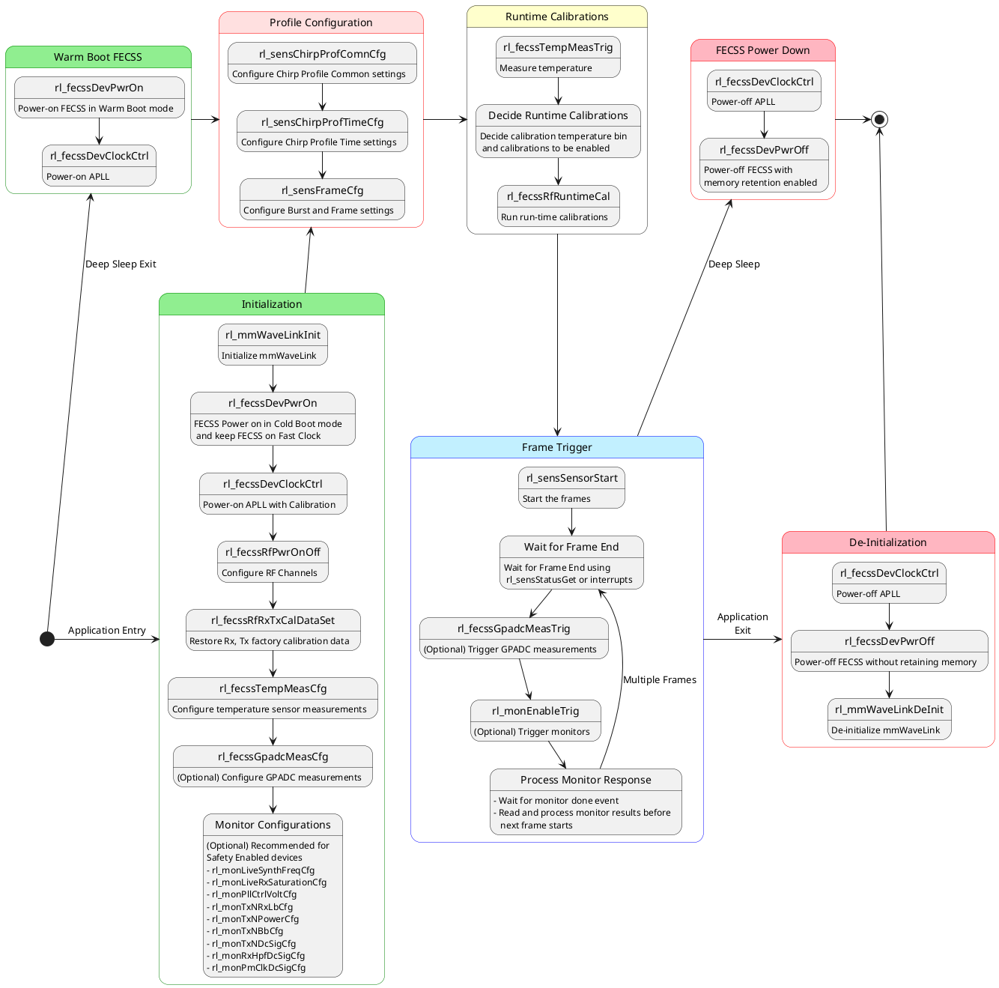
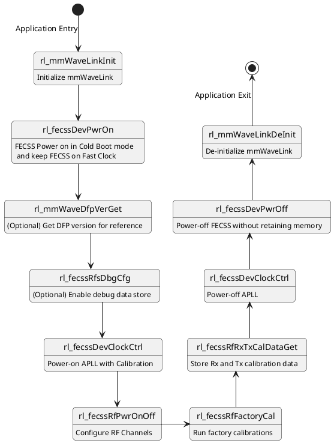

# mmWaveLink 3.x API Documentation {#MMWAVE_LINK_DOC}

mmWaveLink is the top most layer in mmWave DFP, which provides interface to application and allows application to invoke mmWaveLink SW API calls to configure/control the FECSS RF front end.

## mmWaveLink Interface and porting Details
The mmWaveLink application interface and porting details present in below section. \n
\ref mmwl_interface_sec

## mmWaveLink APIs
The mmWaveLink API definition and data structure details present in below section. @n
\ref mmwl_api_sec

### mmWaveLink Device Module APIs
The mmWaveLink Device Module API definition and data structure details present in below section. \n
\ref mmwl_Device_sec

| CMD Id | mmWaveLink API Function              | API Command Structure                       | CMD Size | API Response Structure                   | RSP Size | API Timing (us) \n [DIG_PLL_FREQ = 160MHz] |
| ------ | ------------------------------------ | ------------------------------------------- | -------- | -----------------------------------------| -------- | ----- |
| 0x0001 | @ref rl_mmWaveLinkInit               | @ref T_DFP_CLIENT_CB_DATA                   |      104 | None                                     |        0 | 30 |
| 0x0002 | @ref rl_mmWaveLinkDeInit             | None                                        |        0 | None                                     |        0 | 5 |
| 0x0003 | @ref rl_fecssDevPwrOn                | @ref T_RL_API_FECSS_DEV_PWR_ON_CMD          |       12 | None                                     |        0 | Cold Boot: 850 \n Warm Boot: 450 |
| 0x0004 | @ref rl_fecssDevPwrOff               | @ref T_RL_API_FECSS_DEV_PWR_OFF_CMD         |        8 | None                                     |        0 | 125 |
| 0x0005 | @ref rl_mmWaveDfpVerGet              | None                                        |        0 | @ref T_RL_API_DFP_FW_VER_GET_RSP         |       32 | 10 |
| 0x0006 | @ref rl_fecssRfPwrOnOff              | @ref T_RL_API_FECSS_RF_PWR_CFG_CMD          |       12 | None                                     |        0 | 20 |
| 0x0007 | @ref rl_fecssRfFactoryCal            | @ref T_RL_API_FECSS_RF_FACT_CAL_CMD         |       36 | @ref T_RL_API_FECSS_RF_FACT_CAL_RSP      |       12 | xWRL6432: 1500 \n xWRL1432: 1900 \n (h_CalCtrlBitMask: 0xCE) |
| 0x0008 | @ref rl_fecssRfRuntimeCal            | @ref T_RL_API_FECSS_RF_RUN_CAL_CMD          |       20 | @ref T_RL_API_FECSS_RF_RUN_CAL_RSP       |       12 | xWRL6432: 450 \n xWRL1432: 450 \n (h_CalCtrlBitMask: 0xCE) |
| 0x0009 | @ref rl_fecssRfClockBwCfg            | @ref T_RL_API_FECSS_CLK_BW_CFG_CMD          |       16 | None                                     |        0 | 20 |
| 0x000A | @ref rl_fecssGpadcMeasCfg            | @ref T_RL_API_FECSS_GPADC_MEAS_CMD          |       72 | None                                     |        0 | 10 |
| 0x000B | @ref rl_fecssGpadcMeasTrig           | None                                        |        0 | @ref T_RL_API_FECSS_GPADC_MEAS_RSP       |       20 | 40 (Configuration dependent) |
| 0x000C | @ref rl_fecssTempMeasCfg             | @ref T_RL_API_FECSS_TEMP_MEAS_CMD           |        8 | None                                     |        0 | 5 |
| 0x000D | @ref rl_fecssTempMeasTrig            | None                                        |        0 | @ref T_RL_API_FECSS_TEMP_MEAS_RSP        |       28 | 65 (h_TempCtrlBitMask = 0x311)|
| 0x000E | @ref rl_fecssRfFactoryCalDataGet     | None                                        |        0 | @ref T_RL_API_FECSS_FACT_CAL_DATA        |      128 | 20 |
| 0x000F | @ref rl_fecssRfFactoryCalDataSet     | @ref T_RL_API_FECSS_FACT_CAL_DATA           |      128 | None                                     |        0 | 15 |
| 0x0010 | @ref rl_fecssDevClockCtrl            | @ref T_RL_API_FECSS_DEV_CLK_CTRL_CMD        |        8 | None                                     |        0 | APLL On: 125 \n APLL Cal: 280 \n APLL Off: 10 |
| 0x0011 | @ref rl_fecssDevRdifCtrl             | @ref T_RL_API_FECSS_RDIF_CTRL_CMD           |       28 | None                                     |        0 | 20 |
| 0x0012 | @ref rl_fecssDevStatusGet            | None                                        |        0 | @ref T_RL_API_FECSS_DEV_STS_RSP          |       20 | 20 |
| 0x0013 | @ref rl_fecssRfStatusGet             | None                                        |        0 | @ref T_RL_API_FECSS_RF_STS_GET_RSP       |       12 | 20 |
| 0x0014 | @ref rl_fecssRfFaultStatusGet        | None                                        |        0 | @ref T_RL_API_RFS_FAULT_STS_GET_RSP      |       52 | 10 |
| 0x0015 | @ref rl_fecssDieIdGet                | None                                        |        0 | @ref T_RL_API_SENSOR_DIEID_RSP           |       32 | 5 |
| 0x0016 | @ref rl_fecssRfRxTxCalDataGet        | None                                        |        0 | @ref T_RL_API_FECSS_RXTX_CAL_DATA        |       36 | 10 |
| 0x0017 | @ref rl_fecssRfRxTxCalDataSet        | @ref T_RL_API_FECSS_RXTX_CAL_DATA           |       36 | None                                     |        0 | 10 |
| 0x0018 | @ref rl_fecssRfsDbgCfg               | @ref T_RL_API_FECSS_RFS_DBG_CFG_CMD         |       12 | None                                     |        0 | 20 |
| 0x0019 | @ref rl_fecssRlRuntimeTxClpcCal      | @ref T_RL_API_FECSS_RUNTIME_TX_CLPC_CAL_CMD |       48 | @ref T_RL_API_FECSS_RUNTIME_TX_CLPC_CAL_RSP |    24 | 710 (Per Tx channel) |
### mmWaveLink Sensor Module APIs
The mmWaveLink Sensor Module API definition and data structure details present in below section. \n

| CMD Id | mmWaveLink API Function              | API Command Structure                    | CMD Size | API Response Structure                   | RSP Size | API Timing (us) \n [DIG_PLL_FREQ = 160MHz] |
| ------ | ------------------------------------ | ---------------------------------------- | -------- | -----------------------------------------| -------- | ----- |
| 0x0040 | @ref rl_sensChirpProfComnCfg         | @ref T_RL_API_SENS_CHIRP_PROF_COMN_CFG   |       36 | None                                     |        0 | 15 |
| 0x0041 | @ref rl_sensChirpProfComnCfgGet      | None                                     |        0 | @ref T_RL_API_SENS_CHIRP_PROF_COMN_CFG   |       36 | 15 |
| 0x0042 | @ref rl_sensChirpProfTimeCfg         | @ref T_RL_API_SENS_CHIRP_PROF_TIME_CFG   |       36 | None                                     |        0 | 10 |
| 0x0043 | @ref rl_sensChirpProfTimeCfgGet      | None                                     |        0 | @ref T_RL_API_SENS_CHIRP_PROF_TIME_CFG   |       36 | 10 |
| 0x0044 | @ref rl_sensPerChirpCfg              | @ref T_RL_API_SENS_PER_CHIRP_CFG         |       52 | None                                     |        0 | 15 |
| 0x0045 | @ref rl_sensPerChirpCfgGet           | None                                     |        0 | @ref T_RL_API_SENS_PER_CHIRP_CFG         |       52 | 15 |
| 0x0046 | @ref rl_sensPerChirpCtrl             | @ref T_RL_API_SENS_PER_CHIRP_CTRL        |       36 | None                                     |        0 | 10 |
| 0x0047 | @ref rl_sensPerChirpCtrlGet          | None                                     |        0 | @ref T_RL_API_SENS_PER_CHIRP_CTRL        |       36 | 10 |
| 0x0048 | @ref rl_sensFrameCfg                 | @ref T_RL_API_SENS_FRAME_CFG             |       32 | None                                     |        0 | 10 |
| 0x0049 | @ref rl_sensFrameCfgGet              | None                                     |        0 | @ref T_RL_API_SENS_FRAME_CFG             |       32 | 10 |
| 0x004A | @ref rl_sensSensorStart              | @ref T_RL_API_SENSOR_START_CMD           |       12 | None                                     |        0 | 10 |
| 0x004B | @ref rl_sensSensorStop               | @ref T_RL_API_SENSOR_STOP_CMD            |        8 | None                                     |        0 | 5  |
| 0x004C | @ref rl_sensStatusGet                | None                                     |        0 | @ref T_RL_API_SENSOR_STATUS_RSP          |       32 | 10 |
| 0x004D | @ref rl_sensDynPwrSaveDis            | @ref T_RL_API_SENS_DYN_PWR_SAVE_DIS      |        8 | None                                     |        0 | 20 |
| 0x004E | @ref rl_sensDynPwrSaveStsGet         | None                                     |        0 | @ref T_RL_API_SENS_DYN_PWR_SAVE_DIS      |        8 | 20 |
| 0x004F | @ref rl_sensLoopBackCfg              | @ref T_RL_API_SENS_LOOPBACK_CFG          |       16 | None                                     |        0 | 5 |
| 0x0050 | @ref rl_sensLoopBackEna              | @ref T_RL_API_SENS_LOOPBACK_ENA          |        8 | None                                     |        0 | 20 |

\ref mmwl_Sensor_sec

### mmWaveLink Monitor Module APIs
The mmWaveLink Monitor Module API definition and data structure details present in below section. \n

| CMD Id | mmWaveLink API Function              | API Command Structure                    | CMD Size | API Response Structure                   | RSP Size | API Timing (us)     |
| ------ | ------------------------------------ | ---------------------------------------- | -------- | -----------------------------------------| -------- | ------------------- |
| 0x0080 | @ref rl_monEnableTrig                | @ref T_RL_API_MON_ENABLE_TRIG            |       24 | None                                     |        0 | 20                  |
| 0x0081 | @ref rl_monDbgPdMeas                 | @ref T_RL_API_MON_DBG_PD_MEAS_CMD        |       16 | @ref T_RL_API_MON_DBG_PD_MEAS_RSP        |       24 | 350 (Configuration dependent)                 |
| 0x0082 | @ref rl_monDbgTxPwrMeas              | @ref T_RL_API_MON_DBG_TXPWR_MEAS_CMD     |       12 | @ref T_RL_API_MON_DBG_TXPWR_MEAS_RSP     |       20 | 450 (Configuration dependent)                 |
| 0x0090 | @ref rl_monLiveSynthFreqCfg          | @ref T_RL_API_MON_LIVE_SYNTH_FREQ_CFG    |       12 | None                                     |        0 | 5                   |
| 0x0091 | @ref rl_monLiveRxSaturationCfg       | @ref T_RL_API_MON_LIVE_RX_SATURATION_CFG |        8 | None                                     |        0 | 5                   |
| 0x0092 | @ref rl_monLiveGpadcCtmCfg           | @ref T_RL_API_MON_LIVE_GPADC_CTM_CFG     |        8 | None                                     |        0 | 5                   |
| 0x0093 | @ref rl_monPllCtrlVoltCfg            | @ref T_RL_API_MON_PLL_CTRL_VOLT_CFG      |        8 | None                                     |        0 | 5                   |
| 0x0094 | @ref rl_monTxNRxLbCfg                | @ref T_RL_API_MON_TXN_RX_LB_CFG          |       16 | None                                     |        0 | 5                   |
| 0x0095 | @ref rl_monTxNPowerCfg               | @ref T_RL_API_MON_TXN_POWER_CFG          |       16 | None                                     |        0 | 5                   |
| 0x0096 | @ref rl_monTxNBbCfg                  | @ref T_RL_API_MON_TXN_BB_CFG             |       16 | None                                     |        0 | 5                   |
| 0x0097 | @ref rl_monTxNDcSigCfg               | @ref T_RL_API_MON_TXN_DCSIG_CFG          |       16 | None                                     |        0 | 5                   |
| 0x0098 | @ref rl_monRxHpfDcSigCfg             | @ref T_RL_API_MON_RX_HPF_DCSIG_CFG       |       12 | None                                     |        0 | 5                   |
| 0x0099 | @ref rl_monPmClkDcSigCfg             | @ref T_RL_API_MON_PMCLK_DCSIG_CFG        |       12 | None                                     |        0 | 5                   |

\ref mmwl_Monitor_sec

### References
Refer below modules for more details on mmwaveLink component. \n
- [mmWaveLink Component] (\ref dfp_mmwl_subsec)
- [DFP Interface and Porting] (\ref dfp_interface_sec)
- [mmWaveLink API Module] (\ref MMWAVELINK_API)

## API Programming Sequence
This section includes recommended mmWaveLink API programming sequences required for
typical use cases.
### In-field Operation

### Customer Factory Calibration

## Frame, Burst and Chirp Timing Constraints
@image html chirp_model.svg "Chirp Model"

<table>
<tr>
    <th> </th>
    <th> Power Save Enabled \n (INTER_CHIRP_PS_DIS=0x00) </th>
    <th> Power Save Disabled \n (INTER_CHIRP_PS_DIS=0x1C) </th>
</tr>

<tr>
    <td> <B>Minimum Chirp Idle Time </B> </td>
    <td> max(6us - TX_START_TIME, 3.1us) \n\n <u>Example</u>: <ul><li>TX_START_TIME = 3us <li> MIN_IDLE_TIME = 3.1us</ul> </td>
    <td> max(4.1us - TX_START_TIME, 3.1us) \n\n <u>Example</u>: <ul><li>TX_START_TIME = 0us <li> MIN_IDLE_TIME = 4.1us</ul> </td>
</tr>
<tr>
    <td> <B>Minimum Chirp Ramp End Time</B></td>
    <td colspan="2"> <ul>
        Refer [mmWave Sensing Estimator](https://dev.ti.com/gallery/view/mmwave/mmWaveSensingEstimator) to determine minimum ramp end time.
        </td>
</tr>

</table>

### Burst Cycle Times
Burst Cycle time is dependent on Burst ON (active chirps) and OFF (idle) time. The FECSS needs minimum idle time duration as below for dynamic power up and power down of FEC frontend analog circuits (Inter burst power save).
  The Burst active time (ON) is the collection of number of chirps programmed in a burst.

| Requirements | Duration |
| ------------|-----------------|
| Burst power-up duration \n Pre-burst time required for FECSS to power-up | 65 us |
| Burst power-down duration  \n Post-burst time required for FECSS to power-down | 50 us |
| <B> Minimum Burst Idle Time </B> | <B> 115 us </B> |

### Frame Cycle Times
Frame Cycle time is dependent on Frame ON (active bursts) and OFF (idle) time. The FECSS needs minimum idle time duration as below for dynamic power up and power down of FEC frontend clock circuits (Inter frame power save).
  The Frame active time (ON) is the collection of number of bursts programmed in a frame.

| Requirements | Duration |
| ------------|-----------------|
| Frame power-up duration \n Pre-frame time required for FECSS to power-up | 25 us |
| Frame power-down duration  \n Frame-burst time required for FECSS to power-down | 15 us |
| <B> Minimum Frame Idle Time </B> | <B> 40 us </B> |

## Calibration and Monitoring Timings

### Factory Calibrations
| Calibration | xWRL6432 Timing (us) | xWRL1432 Timing (us) |
|-------------|----------------------|----------------------|
| Synth       | 180                  | 180                  |
| PD          | 220                  | 220                  |
| LoDIST      | 10                   | 10                   |
| Rx Gain     | 425                  | 800                  |
| Tx Power/ Tx| 600                  | 600                  |

### Runtime Calibrations
| Calibration | xWRL6432 Timing (us) | xWRL1432 Timing (us) |
|-------------|----------------------|----------------------|
| Synth       | 180                  | 180                  |
| PD          | 220                  | 220                  |
| LoDIST      | 10                   | 10                   |
| Rx Gain     | 2                    | 2                    |
| Tx Power    | 2                    | 2                    |

### Monitors
| Monitor                     | xWRL6432 (us) | xWRL1432 (us) |
|-----------------------------|---------------|---------------|
| PLL V-Control               | 170           | 170           |
| Tx-Rx Loopback              | 650           | 650           |
| Tx Power (per Tx)           | 250           | 250           |
| Tx Ball-Break (per Tx)      | 250           | 250           |
| Tx DC Signal (per Tx)       | 250           | 250           |
| Rx HPF and DC Signal        | 650           | 650           |
| PM Clock DC Signal          | 250           | 250           |
| DFE-FFT Monitor             | 300           | 300           |
| Static Register Readback    | 50            | 50            |
